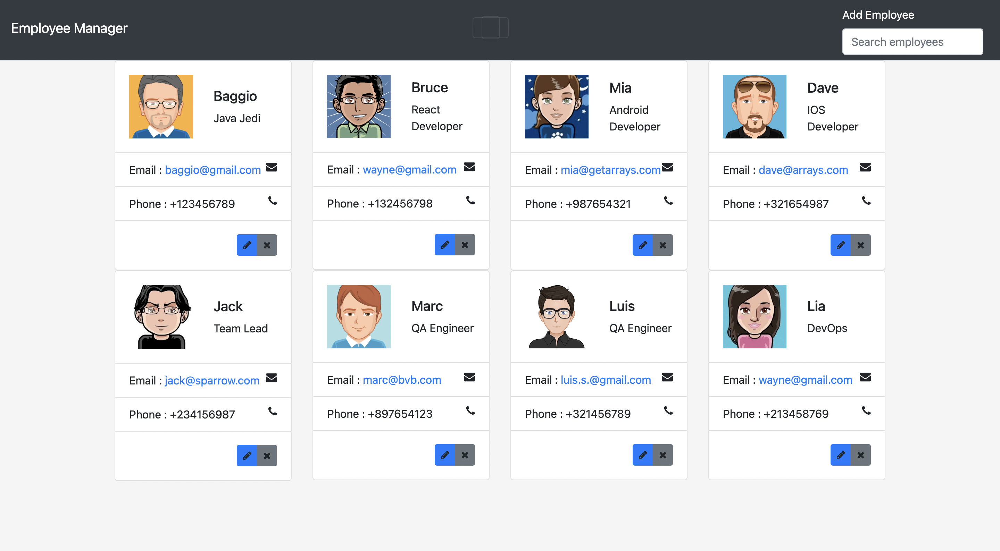
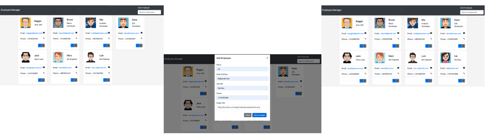
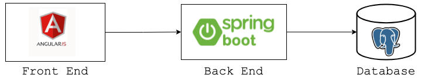
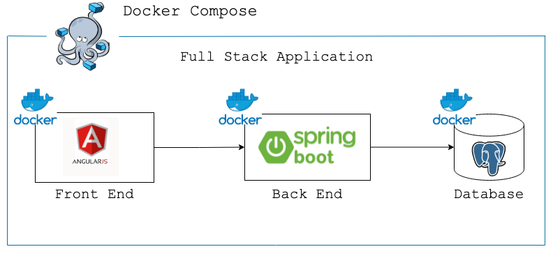

# **Full Stack Application implementing CRUD-Operations**
# Application in Action

## CRUD stands for 4 operations:
#### - Create
#### - READ  (same as - GET)
#### - Update
#### - Delete

### __LET'S see all in action__
### Create

### Read  

### Update

### Delete

##Application Architecture

### Deployment

### If you are curious and want to play around with the app, all you need to deploy the application is just Docker on your laptop installed. Just copy the 'docker-compose.yml' and execute the following command 'docker-compose up (-d)' in the same folder. To stop the app - execute 'docker-compose down'.
